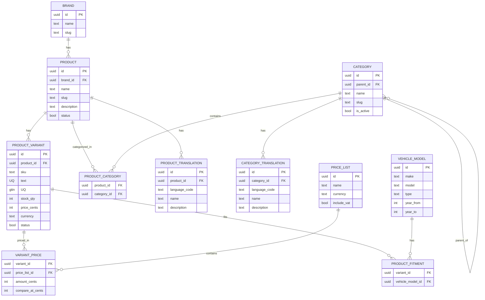
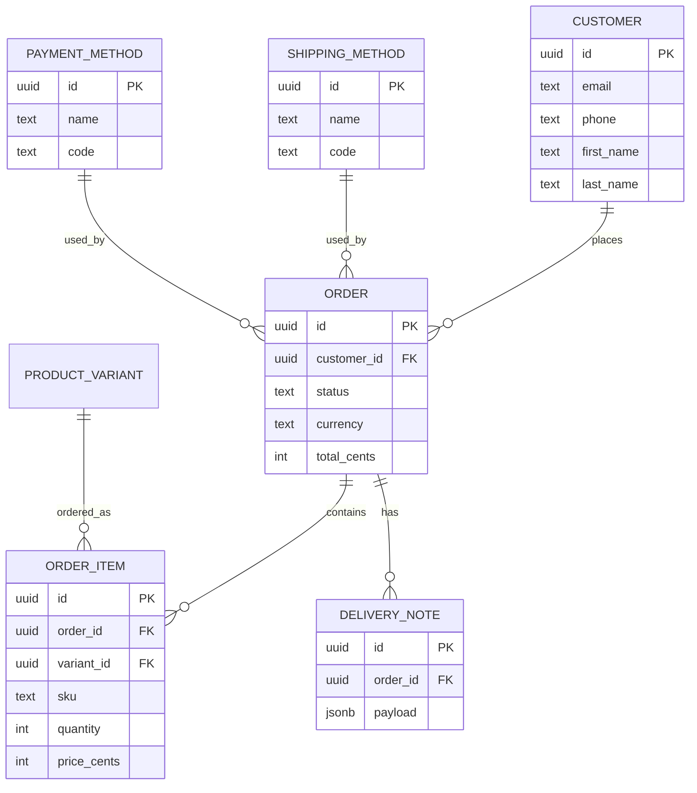

### Ny E‑handel → MC Parts: database schema and API parameter map

This document describes a pragmatic Postgres schema for MC Parts that aligns with Ny E‑handel’s resources and the sync we intend to build. It also lists the expected query and body parameters for each referenced endpoint group, based on the official reference and the payload shapes we sampled via the introspection script.

Notes
- We keep a strict separation between canonical catalog tables and the `external_ref` table that maps MC Parts records to Ny E‑handel ids. This supports multiple stores and simple idempotency.
- Translations are modeled explicitly to support the `X-Language` header.
- Prices support multiple lists and VAT semantics.

---

## Mermaid ER diagrams (schema visualizer)

The following Mermaid diagrams visualize the schema relationships (similar to Supabase’s visualizer). GitHub and many markdown tools render Mermaid blocks directly.

### Core catalog



### Orders and customers



### External mapping (Ny E‑handel ids)

```mermaid
erDiagram
  EXTERNAL_REF }o..|| PRODUCT : maps
  EXTERNAL_REF }o..|| PRODUCT_VARIANT : maps
  EXTERNAL_REF }o..|| CATEGORY : maps
  EXTERNAL_REF }o..|| CUSTOMER : maps
  EXTERNAL_REF }o..|| ORDER : maps

  EXTERNAL_REF {
    uuid id PK
    text provider   -- 'nyehandel'
    text store_identifier
    text external_type
    text external_id
    text internal_table
    uuid internal_id
    text payload_hash
  }
```

---

#### Entity relationships (high level)
- product (1) ─── (n) product_variant
- product (n) ─── (n) category (via product_category)
- product_variant (n) ─── (n) vehicle_model (via product_fitment) — domain‑specific for MC parts
- product_variant (1) ─── (n) variant_price (per price list)
- price_list (1) ─── (n) variant_price
- product (1) ─── (n) product_translation
- category (1) ─── (n) category_translation
- external_ref links any local record to Ny E‑handel ids (store aware)
- order (1) ─── (n) order_item (each references product_variant)
- order (1) ─── (n) delivery_note
- customer (1) ─── (n) order

---

#### Postgres tables (DDL‑style overview)

```sql
-- Core catalog
create table brand (
  id uuid primary key default gen_random_uuid(),
  name text not null,
  slug text unique
);

create table category (
  id uuid primary key default gen_random_uuid(),
  parent_id uuid references category(id) on delete set null,
  name text not null,
  slug text,
  is_active boolean default true,
  path ltree, -- optional if we add ltree for fast ancestry
  created_at timestamptz default now(),
  updated_at timestamptz default now()
);
create index if not exists idx_category_parent on category(parent_id);

create table category_translation (
  id uuid primary key default gen_random_uuid(),
  category_id uuid not null references category(id) on delete cascade,
  language_code text not null,
  name text,
  description text,
  seo_title text,
  seo_description text,
  unique(category_id, language_code)
);

create table product (
  id uuid primary key default gen_random_uuid(),
  brand_id uuid references brand(id),
  name text not null,
  slug text,
  description text,
  status boolean default true,
  created_at timestamptz default now(),
  updated_at timestamptz default now()
);

create table product_translation (
  id uuid primary key default gen_random_uuid(),
  product_id uuid not null references product(id) on delete cascade,
  language_code text not null,
  name text,
  description text,
  seo_title text,
  seo_description text,
  unique(product_id, language_code)
);

create table product_category (
  product_id uuid not null references product(id) on delete cascade,
  category_id uuid not null references category(id) on delete cascade,
  primary key(product_id, category_id)
);

create table product_variant (
  id uuid primary key default gen_random_uuid(),
  product_id uuid not null references product(id) on delete cascade,
  sku text not null,
  gtin text,
  oem_part_number text,
  attributes jsonb,
  price_cents integer, -- default list price if single‑price setups
  currency text,
  stock_qty integer,
  status boolean default true,
  weight_grams integer,
  dimensions jsonb,
  created_at timestamptz default now(),
  updated_at timestamptz default now(),
  unique(sku),
  unique(gtin)
);

-- Optional: fitment (motorcycle/moped)
create table vehicle_model (
  id uuid primary key default gen_random_uuid(),
  make text,
  model text,
  type text check (type in ('motorcycle','moped')),
  year_from int,
  year_to int,
  cc int,
  engine text
);
create table product_fitment (
  variant_id uuid references product_variant(id) on delete cascade,
  vehicle_model_id uuid references vehicle_model(id) on delete cascade,
  primary key(variant_id, vehicle_model_id)
);

-- Prices (multi list and VAT semantics)
create table price_list (
  id uuid primary key default gen_random_uuid(),
  name text not null,
  currency text not null,
  include_vat boolean default true,
  external_ref jsonb -- store/price list mapping if present
);
create table variant_price (
  variant_id uuid not null references product_variant(id) on delete cascade,
  price_list_id uuid not null references price_list(id) on delete cascade,
  amount_cents integer not null,
  compare_at_cents integer,
  valid_from timestamptz,
  valid_to timestamptz,
  tax_class text,
  primary key(variant_id, price_list_id, coalesce(valid_from, to_timestamp(0)), coalesce(valid_to, to_timestamp(0)))
);

-- External mapping to Ny E‑handel (and future providers)
create table external_ref (
  id uuid primary key default gen_random_uuid(),
  provider text not null, -- 'nyehandel'
  store_identifier text not null, -- value used in X-identifier
  external_type text not null, -- 'product'|'variant'|'category'|...
  external_id text not null,
  internal_table text not null, -- 'product'|'product_variant'|'category'|...
  internal_id uuid not null,
  payload_hash text,
  last_synced_at timestamptz,
  unique(provider, store_identifier, external_type, external_id),
  unique(provider, store_identifier, internal_table, internal_id, external_type)
);

-- Customers & orders
create table customer (
  id uuid primary key default gen_random_uuid(),
  email text,
  phone text,
  first_name text,
  last_name text,
  company text,
  billing_address jsonb,
  shipping_address jsonb,
  created_at timestamptz default now()
);

create table "order" (
  id uuid primary key default gen_random_uuid(),
  external_order_number text, -- Ny order id/number, mapped via external_ref as well
  customer_id uuid references customer(id),
  status text,
  currency text,
  subtotal_cents integer,
  shipping_cents integer,
  tax_cents integer,
  discount_cents integer,
  total_cents integer,
  created_at timestamptz default now(),
  updated_at timestamptz default now()
);

create table order_item (
  id uuid primary key default gen_random_uuid(),
  order_id uuid not null references "order"(id) on delete cascade,
  variant_id uuid references product_variant(id),
  sku text,
  name text,
  quantity int not null,
  price_cents integer not null,
  currency text not null
);

create table delivery_note (
  id uuid primary key default gen_random_uuid(),
  order_id uuid not null references "order"(id) on delete cascade,
  payload jsonb,
  created_at timestamptz default now()
);

-- Lookups
create table shipping_method (
  id uuid primary key default gen_random_uuid(),
  name text not null,
  code text unique,
  active boolean default true
);
create table payment_method (
  id uuid primary key default gen_random_uuid(),
  name text not null,
  code text unique,
  active boolean default true
);
create table currency (
  code text primary key,
  name text,
  symbol text
);

-- Optional: purchases feed from Ny E‑handel
create table purchase (
  id uuid primary key default gen_random_uuid(),
  payload jsonb,
  created_at timestamptz default now()
);
```

---

### Endpoint → parameters map

The following lists the endpoint groups, expected HTTP method and path, and the key parameters. Pagination uses `page` and `pageSize`. All requests require `X-identifier`, `Authorization: Bearer <token>`, `Accept: application/json`, `Content-Type: application/json`, and optional `X-Language`.

Legend
- Q: query string parameter
- B: JSON body field

#### Order
- Get order
  - Method/Path: GET `/orders/{id}`
  - Q: none
  - Response maps to `order` + `order_item[]` and `delivery_note[]`
- Get orders
  - Method/Path: GET `/orders`
  - Q: `page`, `pageSize`, `status`, `createdFrom`, `createdTo`, `customerId`, `search`, `sort`
- Create order
  - Method/Path: POST `/orders`
  - B: `customer` (object or `customerId`), `currency`, `items[]` (each: `sku`|`variantId`, `quantity`, optional `price`), `shippingMethod`, `paymentMethod`, `addresses`
- Deliver order
  - Method/Path: POST `/orders/{id}/deliver`
  - B: `shipments[]` (carrier, trackingNo, lines[] {itemId|sku, qty}), booking metadata
- Update order
  - Method/Path: PATCH `/orders/{id}`
  - B: any updatable fields: `status`, `addresses`, `notes`
- Get delivery notes
  - Method/Path: GET `/orders/{id}/delivery-notes`
  - Q: `page`, `pageSize`

#### Shipping Method
- Get shipping methods
  - Method/Path: GET `/shipping-methods`
  - Q: `page`, `pageSize`, `active`

#### Product
- Relation between products and variants
  - Variants belong to a product; create variants under a product id; variant carries SKU/GTIN and price/stock
- Get products
  - Method/Path: GET `/products`
  - Q: `page`, `pageSize`, `categoryId`, `brandId`, `sku`, `search`, `modifiedFrom`, `include=variants|categories`, `sort`
- Update products batch
  - Method/Path: PATCH `/products/batch`
  - B: `products[]` (objects like in Update product)
- Create products batch
  - Method/Path: POST `/products/batch`
  - B: `products[]` (objects like in Create product)
- Create product
  - Method/Path: POST `/products`
  - B: `name`, `description`, `brandId|brandName`, `categories[]`, `attributes`, `images[]`, `translations[]`, `status`
- Update product
  - Method/Path: PATCH `/products/{id}`
  - B: same fields as create (partial)
- Create variant
  - Method/Path: POST `/products/{productId}/variants`
  - B: `sku` (required), `gtin`, `oemPartNumber`, `attributes`, `price`/`prices[]`, `currency`, `stockQty`, `images[]`, `status`
- Find product by sku or id
  - Method/Path: GET `/products/find`
  - Q: `id` or `sku`
- Delete product
  - Method/Path: DELETE `/products/{id}`

#### Variant
- Update variant batch
  - Method/Path: PATCH `/product-variants/batch`
  - B: `variants[]` (each: `id`|`sku`|`gtin`, updatable fields such as `price`/`prices[]`, `currency`, `stockQty`, `attributes`, `status`)
- Update variant
  - Method/Path: PATCH `/product-variants/{id}`
  - B: fields as above
- Delete product variant
  - Method/Path: DELETE `/product-variants/{id}`
- Find variant
  - Method/Path: GET `/product-variants/find`
  - Q: `id` or `sku` or `gtin`

#### Payment Method
- Get payment methods
  - Method/Path: GET `/payment-methods`
  - Q: `page`, `pageSize`, `active`

#### Customer
- Get customer
  - Method/Path: GET `/customers/{id}`
  - Q: none
- Get customers
  - Method/Path: GET `/customers`
  - Q: `page`, `pageSize`, `email`, `phone`, `search`, `createdFrom`, `createdTo`
- Create customer
  - Method/Path: POST `/customers`
  - B: `email`, `phone`, `firstName`, `lastName`, `company`, `billingAddress`, `shippingAddress`

#### Category
- Create category
  - Method/Path: POST `/categories`
  - B: `name`, `parentId`, `slug`, `isActive`, `translations[]`
- Update category
  - Method/Path: PATCH `/categories/{id}`
  - B: partial of the above
- Get category
  - Method/Path: GET `/categories/{id}`
  - Q: none
- Delete category
  - Method/Path: DELETE `/categories/{id}`
- Get categories
  - Method/Path: GET `/categories`
  - Q: `page`, `pageSize`, `parentId`, `active`, `search`

#### Currency
- Get currencies
  - Method/Path: GET `/currencies`
  - Q: none (may be paginated)

#### Headless (Pages & Categories)
- Pages: GET `/pages/{id}`, GET `/pages`
  - Q (list): `page`, `pageSize`, `search`
- Categories: GET `/headless/categories/{id}`, GET `/headless/categories`
  - Q (list): `page`, `pageSize`, `search`
- Startpage: GET `/startpage`

#### Purchase
- Get purchases
  - Method/Path: GET `/purchases`
  - Q: `page`, `pageSize`, filter set per docs (e.g., date range, supplier)

---

### Mapping to local schema

- Products from Ny map to `product` and possibly set of `product_translation` rows when called with `X-Language`.
- Variants map to `product_variant` and `variant_price` (if Ny exposes multiple price lists or price tiers).
- Categories map to `category` + `category_translation`; relations via `product_category`.
- Customers map to `customer`; orders to `order` + `order_item`; shipment artifacts to `delivery_note`.
- External ids for products/variants/categories/customers/orders are tracked in `external_ref` with `provider='nyehandel'` and `store_identifier=<X-identifier>`.

---

### Filters and pagination

- Pagination: `page` and `pageSize` (observed in responses and used in our introspector).
- Common filters used throughout lists: `search`, `modifiedFrom` (ISO datetime), status fields, foreign keys (`categoryId`, `customerId`, etc.). Exact names are to be confirmed per endpoint, but the schema supports all with standard indexes.

---

### Next

- Confirm any endpoint‑specific field names that differ from the above by cross‑checking each reference page; refine query/body keys where needed.
- Generate Drizzle models + migrations from this DDL and connect `external_ref` usage in the sync jobs.
```diff
Open questions to confirm in the docs
1) Variant list endpoint: we’ve successfully hit `/product-variants` in v2 during introspection; confirm official path and search params (sku, gtin).
2) Price model: are prices VAT‑inclusive, and are multiple price lists exposed? If yes, confirm list identifiers.
3) Order deliver payload shape (carrier/tracking fields).
4) Purchase filters: the docs mention filters; confirm exact keys.
```


